# 🍁Plant Leaf Disease Detection 🍁

## Introduction
In the era of precision agriculture, the ability to swiftly and accurately diagnose plant diseases is crucial for ensuring crop health and maximizing yield. The **Plant Leaf Disease Detection** project is designed to address this need by leveraging advanced image processing and machine learning techniques.

This project aims to create a user-friendly web application that allows farmers, agronomists, and plant enthusiasts to easily identify diseases affecting various types of plants by analyzing leaf images. By utilizing a combination of GLCM (Gray Level Co-occurrence Matrix) and HSV (Hue, Saturation, Value) feature extraction methods, our application provides reliable predictions for a range of leaf diseases.

With a focus on accessibility and effectiveness, this tool empowers users to take proactive measures in managing plant health, ultimately contributing to sustainable agricultural practices. Whether you are a farmer looking to protect your crops or a researcher studying plant diseases, our application is here to assist you in making informed decisions.

### Screenshots
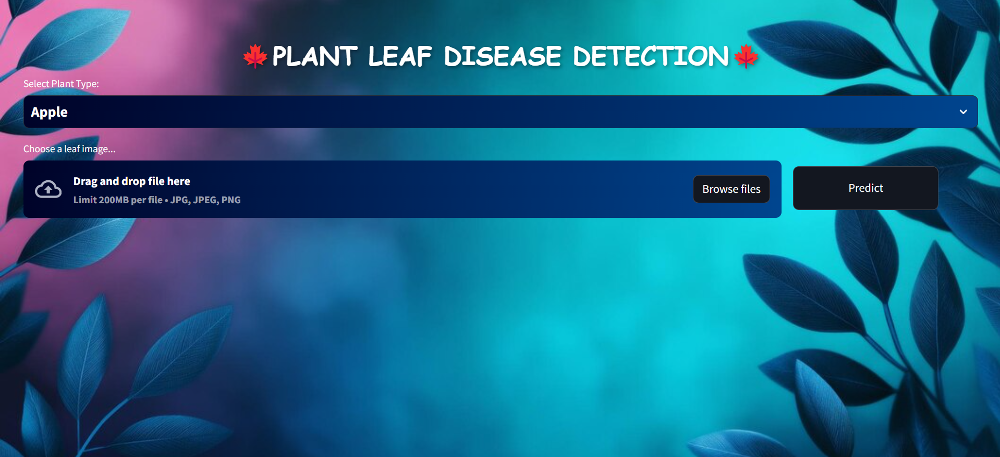
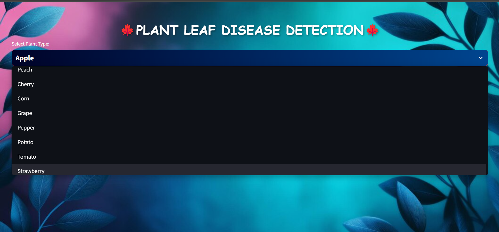
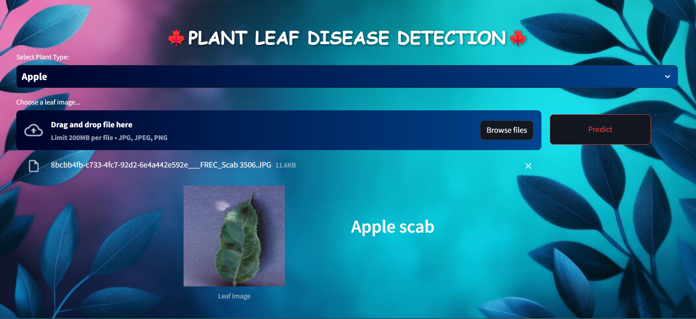
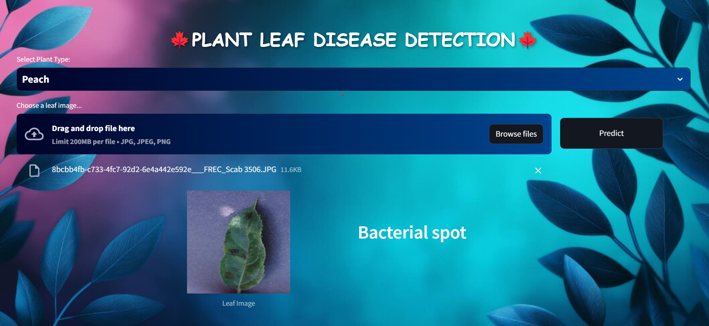
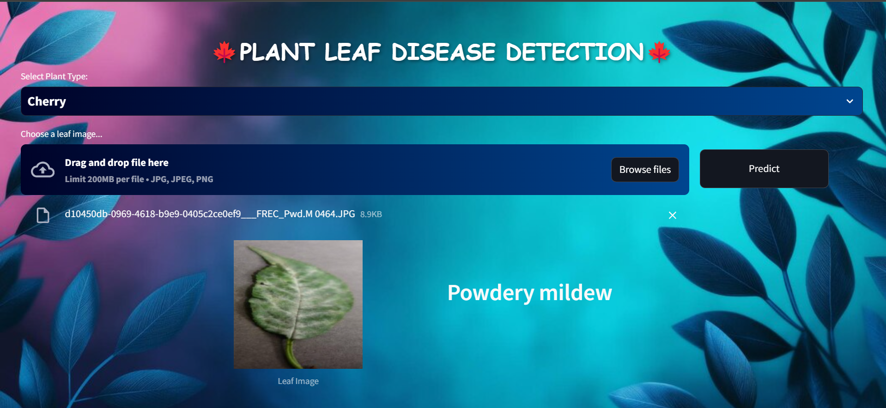
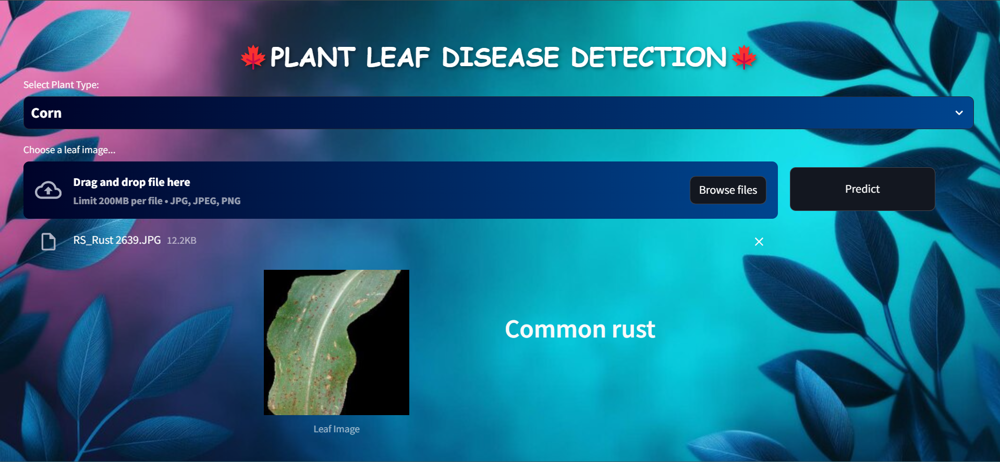
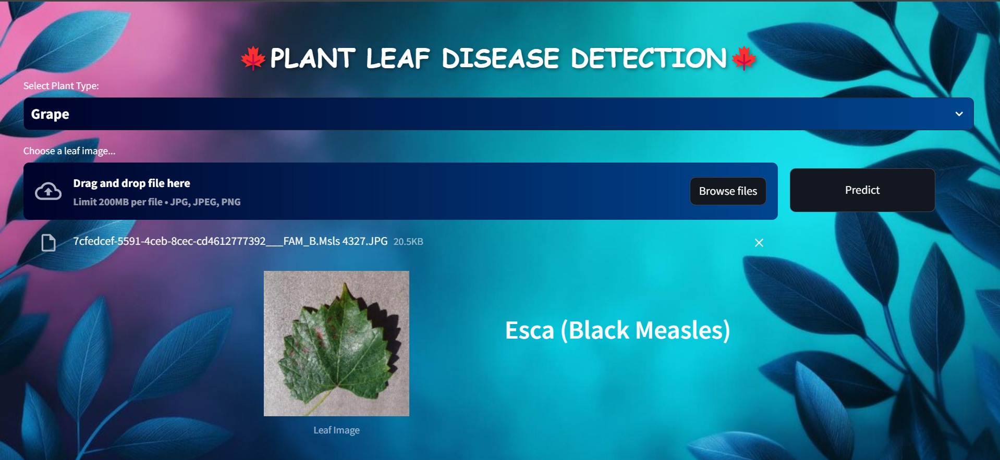
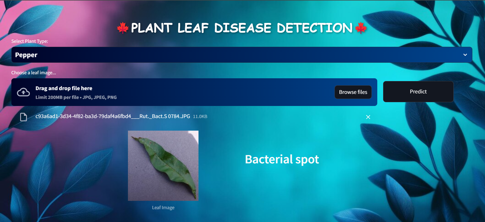
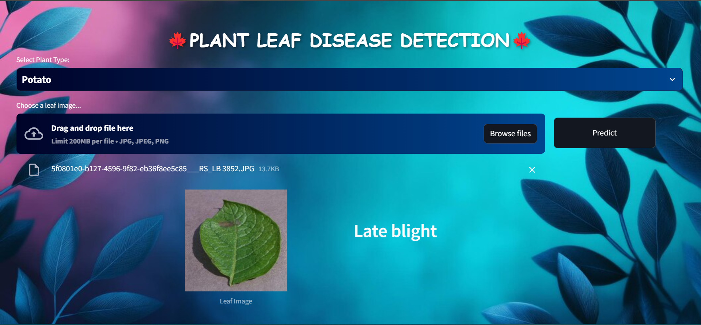
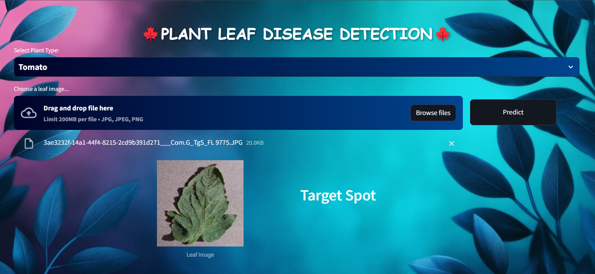
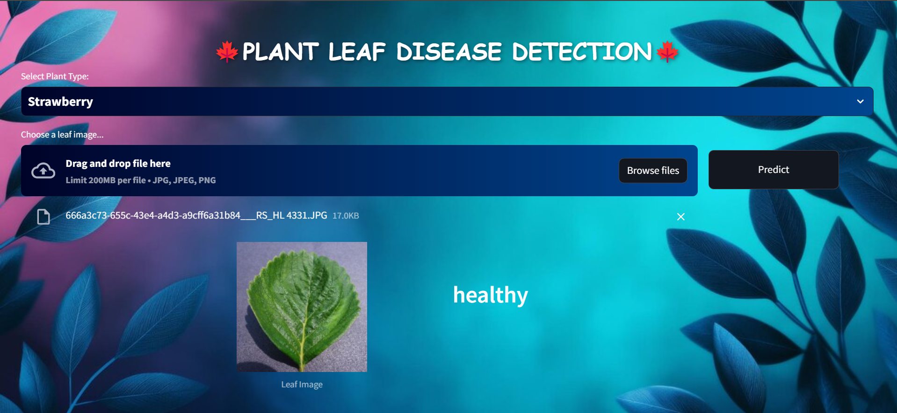
