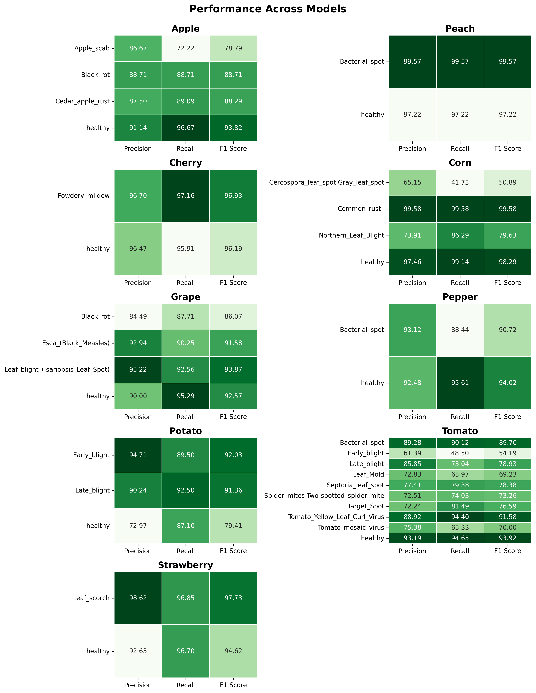

## 🍁Plant Leaf Disease Detection 🍁

### Introduction
In the era of precision agriculture, the ability to swiftly and accurately diagnose plant diseases is crucial for ensuring crop health and maximizing yield. The **Plant Leaf Disease Detection** project is designed to address this need by leveraging advanced image processing and machine learning techniques.

This project aims to create a user-friendly web application that allows farmers, agronomists, and plant enthusiasts to easily identify diseases affecting various types of plants by analyzing leaf images. By utilizing a combination of GLCM (Gray Level Co-occurrence Matrix) and HSV (Hue, Saturation, Value) feature extraction methods, our application provides reliable predictions for a range of leaf diseases.

With a focus on accessibility and effectiveness, this tool empowers users to take proactive measures in managing plant health, ultimately contributing to sustainable agricultural practices. Whether you are a farmer looking to protect your crops or a researcher studying plant diseases, our application is here to assist you in making informed decisions.

### About Dataset
In this context, the PlantVillage dataset, consisting of over 50,000 expertly curated images of healthy and diseased crop leaves, offers a critical resource. Leveraging advances in machine learning and computer vision, this dataset supports the development of automated, mobile-based disease diagnostics that can empower farmers around the world. By turning smartphones into powerful diagnostic tools, the project aims to help farmers identify diseases early and take timely action to prevent devastating crop losses.The dataset covers 14 different crop species, including Apple, Tomato, Grape, Corn, and Potato, among others. Additionally, it identifies 38 distinct diseases that affect these plants, such as Apple Scab, Black Rot, and Tomato Leaf Mold. 

This diversity of plant species and diseases makes the dataset highly valuable for developing robust plant disease recognition models.This dataset offers the potential to improve disease diagnostics by enabling the development of mobile applications that can help farmers around the world, especially in developing regions, diagnose plant diseases early and accurately

### Image Preprocessing 

### Feature Extraction 

### Model Performance

### Screenshots

